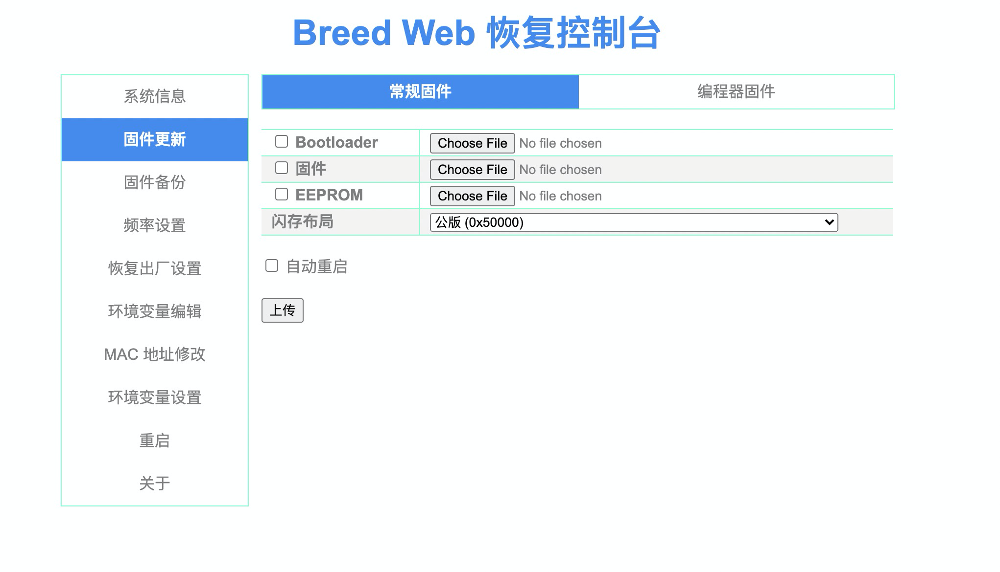
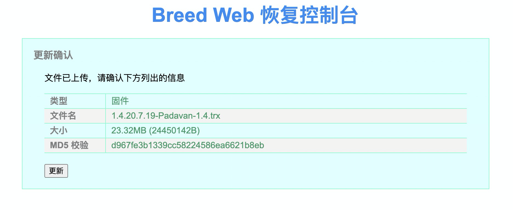

# 科学上网指南

## 导航
- [声明](https://github.com/BobbyLH/Scientific_Surf_The_Internet#%E5%A3%B0%E6%98%8E)

- [一、前期准备](https://github.com/BobbyLH/Scientific_Surf_The_Internet#%E4%B8%80%E5%89%8D%E6%9C%9F%E5%87%86%E5%A4%87)

- [二、云服务器选择](https://github.com/BobbyLH/Scientific_Surf_The_Internet#%E4%BA%8C%E4%BA%91%E6%9C%8D%E5%8A%A1%E5%99%A8%E9%80%89%E6%8B%A9)

- [三、服务 vs. 服务器](https://github.com/BobbyLH/Scientific_Surf_The_Internet#%E4%B8%89%E6%9C%8D%E5%8A%A1-vs-%E6%9C%8D%E5%8A%A1%E5%99%A8)

- [四、一键安装](https://github.com/BobbyLH/Scientific_Surf_The_Internet#%E5%9B%9B%E4%B8%80%E9%94%AE%E5%AE%89%E8%A3%85tls--ws--v2ray--nginx--bbr)

- [五、路由器篇](https://github.com/BobbyLH/Scientific_Surf_The_Internet#%E4%BA%94%E8%B7%AF%E7%94%B1%E5%99%A8%E7%AF%87)

- [六、其他客户端选择](https://github.com/BobbyLH/Scientific_Surf_The_Internet#%E5%85%AD%E5%85%B6%E4%BB%96%E5%AE%A2%E6%88%B7%E7%AB%AF%E9%80%89%E6%8B%A9)

- [七、最后的话](https://github.com/BobbyLH/Scientific_Surf_The_Internet#%E4%B8%83%E6%9C%80%E5%90%8E%E7%9A%84%E8%AF%9D)

- [彩蛋 Netflix 解锁非自制剧](https://github.com/BobbyLH/Scientific_Surf_The_Internet#%E5%BD%A9%E8%9B%8B-netflix-%E8%A7%A3%E9%94%81%E9%9D%9E%E8%87%AA%E5%88%B6%E5%89%A7)

## 声明
**本仓库仅用于测试和学习研究，禁止用于商业用途，作者不保证其合法性，准确性，完整性和有效性，请根据情况自行判断。**

---

在符合中华人民共和国法律的前提下，学会科学、正确、合理的上网，是作为一个合法的中国公民必须具备的基本素养！这本小册子的目的是为了让我们在某些弱网环境下，更方便，更快捷的获取到网络上的一些资源，但前提是一定要保证你获取的资源是合法的！

## 一、前期准备
想要科学、正确、合理且合法的上网，前期的准备工作少不了。就算你真的嫌麻烦，那你也需要加入某个相对稳定的 [vpn](https://zh.wikipedia.org/wiki/%E8%99%9B%E6%93%AC%E7%A7%81%E4%BA%BA%E7%B6%B2%E8%B7%AF) 节点。不过，我个人更看重的是举一反三的能力，**授人渔** 才是这本小册子的真实目的。

接下来，我们讨论的是如何自己动手搭建一套属于自己的 [vps](https://zh.wikipedia.org/wiki/%E8%99%9A%E6%8B%9F%E4%B8%93%E7%94%A8%E6%9C%8D%E5%8A%A1%E5%99%A8)，别看它和 *vpn* 只差一个字母，但技术含量和难以程度都如同云泥！(我身边就有不少程序猿依然只会使用别人提供的vpn，想想都替他们感到那啥……)

想要有一个自己的 *vps*，你至少需要以下几个条件👇：
1. 一台属于自己的 **云服务器**，别管配置，哪怕 *0.5G内存 + 1核CPU* 也行；

2. 一个能在你的 *云服务器* 上跑起来的 **服务**；(关于服务器和服务的区别，后面有说明)

3. 一个属于自己的 **域名**(可选，但最好有)，可以去 [腾讯云](https://cloud.tencent.com/act/domainsales) 或者 [万网](https://www.hichina.com/)(阿里旗下) 购买；

4. **最重要的一点：拥有 _相信自己一定能行_ 的信心**。

---

## 二、云服务器选择
推荐几个比较常见的云服务供应商，以作参考。

针对低端用户，笔者尝试过国内的阿里云、百度云、腾讯云、新浪云，对于服务稳定性而言，比较推荐[腾讯云](https://cloud.tencent.com)，如果考虑价格等其他因素，其实各大厂商对于新用户都有优惠政策，可根据自己的实际情况选择。

对于境外的运营商，考虑到 *支付的便捷性*，推荐[vultr](https://www.vultr.com/)；vultr 的相关优惠，可以在搜索引擎中输入 `vultr新用户优惠` 关键字进行搜索。

但若考虑到 *稳定性* 和 *长期使用的成本*，最为推荐的是 [AWS](https://aws.amazon.com/cn/)，因为综合对比下来，AWS 的价格更为低廉，且稳定性较高，但上手难度比 vultr 高一些，需要有双币种(Visa、Mastercard 等)的信用卡或借记卡。

另外，亚马逊的AWS 和 微软的Azure 都有一年的免费使用套餐，谷歌云则有3个月的免费套餐，大家视自己情况而定。

### 国内的云服务器供应商
1. [腾讯云](https://cloud.tencent.com)

2. [阿里云](https://cn.aliyun.com)

3. [百度云](https://cloud.baidu.com/)

4. [新浪云](https://www.sinacloud.com/)

5. [华为云](https://www.huaweicloud.com/)

6. [UCloud](https://www.ucloud.cn/)

### 国外的云服务器供应商
1. [vultr](https://www.vultr.com/)

2. [搬瓦工](https://bandwagonhost.com/)

3. [AWS](https://aws.amazon.com/cn/)

4. [Azure](https://azure.microsoft.com/)

5. [谷歌云](https://cloud.google.com/)


### 正/反 向代理服务器
*代理服务器*，就是我们 **合法、科学** 上网的核心 —— 即使用你在👆上面这些云服务器供应商购买的云服务器，然后将你的资源获取请求事先发送到这些云服务器，而后这些 *代理服务器* 会代理你要请求的资源，最终将这些请求到的资源返回给你。

关于 *代理服务器* 的详细概念介绍，详见[维基百科](https://zh.wikipedia.org/wiki/%E4%BB%A3%E7%90%86%E6%9C%8D%E5%8A%A1%E5%99%A8)

---

## 三、服务 vs. 服务器
千万别天真的认为，你只要购买了 *云服务器* 就实现能代理你的资源请求！想想看你的电脑想要运行起来，光靠电脑本身的硬件 *CPU*、*GPU*、*内存*……显然是不够的，还要安装最基本的操作系统才行。

因此，**云服务器** 你可以把它简单理解成 *硬件*，而在这个服务器上，我们还需要安装相应的 **服务**，即 *软件*，才能让整个系统正常的运行起来。

### 服务
大多数的编程语言，配合相应的编译和解释器，都能在你的电脑上直接运行起来。但程序一旦运行完毕，这世界就好像什么都没发生一样(当然发生了点什么)，计算机依然安静的等待你继续下一个操作。

突然有一天，你想让你的计算机能够持续运行，或者说保持某种待命的状态，一旦有任何你的风吹草动，它都会再次执行你之前定义好的任务 —— 我们简单的将这样的特性理解为 **服务** —— 就好比定义好一个 *问候* 的任务给计算机，一旦有人访问它，它立马返回你定义好的问候语句，就比如大部分的编程课的第一章都是教你如何写出一个 `hello, world!`。

我们想要 **合法、科学** 的上网也离不开服务，而执行这些服务的基础，早已有很多很多开源的项目(感谢开源)。常见的服务基础设置有 *apache*、*tomcat*、*nginx*、*caddy*……一旦有了这些基础的服务设置，然后再配合你编写的脚本程序，就能对外提供服务了。

**Tips**: 编写服务的脚本语言有很多，比如 *PHP*、*Java*、*Javascript*、*go*、*python*……

我们在这里重点关注以下几个服务的安装和配置：
1. [nginx - 官网](https://nginx.org/en/docs/)

2. ~~[caddy - 官网](https://caddyserver.com/v1/docs)~~

3. [v2ray - 官网](https://www.v2ray.com/)

4. ~~[ssr - github](https://github.com/shadowsocksrr/shadowsocksr)~~

### 亲尝有效的服务配置
1. ~~**ssr + caddy + tls**：ssr 做反向代理，转发普通请求到 caddy 服务(自带tls)，对于其他请求，则进行正向代理；~~

2. **v2ray + nginx + tls**：nginx 做反向代理，将自定义的某个路由转发到 v2ray 服务进行正向代理，需要手动配置tls。

### 服务器配置导航
1. ~~ssr + caddy + tls 模式~~
    * ~~[ssr 基本配置](/ssr.md) —— (兼具正、反向代理服务，搭配caddy)~~

    * ~~[caddy 基本配置](/caddy.md) —— (web服务，搭配ssr)~~

2. v2ray + nginx + tls 模式
    * [v2ray 基本配置](/v2ray.md) —— (正向代理服务，搭配nginx)

    * [nginx 基本配置](/nginx.md) —— (反向代理服务，同时也是web服务，搭配v2ray)

**Tips**: 按照目前的情况，大部分的 `ssr` 项目都年久失修，长期处于停滞维护更新的状态，而且特征往往十分明显，故而不太推荐该方案。除了 `v2ray + nginx + tls` 的模式之外，[Trojan](https://github.com/trojan-gfw/trojan) 同样也是一个优秀的实现方案。

### 防火墙之安全组规则
如果你购买的是国内的云服务，一般来说都有安全限制，此时你需要手动设置你的 [安全组规则](https://baike.baidu.com/item/%E5%AE%89%E5%85%A8%E7%BB%84)，开放对应端口(包括TCP和UDP协议)出入站的权限，而后将规则绑定到云服务的实例上。

- [腾讯云安全组规则](https://cloud.tencent.com/document/product/213/12452)

- [阿里云安全组规则](https://help.aliyun.com/document_detail/25471.html)

---

## 四、一键安装(tls + ws + v2ray + nginx + bbr)
如果嫌麻烦不想配置诸多环境，可以使用👇下面的办法一键安装最优配置

**配置要求：x86_64 + ubuntu>=18.04 / debian>=10.8**

### 获取root权限
```sh
sudo su
```

### 一键安装
```sh
wget --no-check-certificate -O /tmp/install.sh https://github.com/BobbyLH/Scientific_Surf_The_Internet/raw/master/install.sh &&\
chmod 755 /tmp/install.sh &&\
/tmp/install.sh &&\
rm /tmp/install.sh
```

---

## 五、路由器篇
服务都搭建好了，但是每台设备都需要安装相应的客户端才能达到实际想要的效果，这很不爽。解决的办法也很简单 —— 用路由器作为入口终端，代理所有的请求，在这个局域网下，所有的设备自然而然就达到了预期的效果。

市面上的路由器很多很杂，中高端里较为推荐 **华硕** 和 **网件**，质量稳定，功能强大(因为梅林)。稍次一些就比较多了，比如 Tenda、TPLink、水星、小米路由器、联想路由器、360路由器……，虽便宜，也能胜任工作。

笔者自家使用的是两台ASUS(华硕)组成的Aimesh，一台是AC68U，一台是AC66U-B1，价格相差无几，稳定性、功能、信号强度都没太多区别，关键是它们都采用了 博通方案，刷梅林固件几乎是傻瓜式，相关的教程也很多，就不再赘述。

贴两个地址：

[梅林固件下载地址](http://firmware.koolshare.cn/)

[KX上网工具地址](https://github.com/hq450/fancyss)

### 刷固件
要刷固件，路由器的型号一定要选对，不是每个路由器都适合或是能够刷固。下面以国货之光，联想的 *新路由3(newwifi-3)*，作为刷固的教程。

*新路由3* 应该是性价比较高的机型了，二手某宝价格在100元RMB左右，便宜的甚至能到60元，机器配置不低(双核 + 512M 内存)，网上其刷固的教程也很多，此乃国货之光，值得入手。

#### 什么是路由器固件?
所谓的路由器固件，可以简单理解为路由器的操作系统。一般我们在市面上能够买到的路由器，都是由路由器厂家提供好了一套原厂的操作系统，其功能单一，不能很好的满足我们一些需求(华硕除外)。

一般来讲，中高端玩家可以直接选择华硕的路由器，省去了刷固的烦劳，毕竟自带梅林固件，而中低端玩家，那就要自己动手了，毕竟钱也不是那么好省的。

主流固件列表：
- [梅林](https://www.asuswrt-merlin.net/about)

- [老毛子 Padavan](https://github.com/hanwckf/rt-n56u)

- [Openwrt](https://openwrt.org/)

- [潘多拉 PandoraBox](https://bbs.pangubox.com/)

- [高恪](http://www.gocloud.cn/bbs/forum.php)

#### 给路由器刷入Breed
Breed 就好像我们电脑开机时启动的 UEFI、BIOS 等基本系统一样，提供了各种硬件的设备信息，用来给上层操作系统(windows、linux)提供支持。

以 新路由3 为例，在 MacOS 操作系统下，刷入的步骤很简单：

- [下载 Breed 附件](https://github.com/BobbyLH/Scientific_Surf_The_Internet/raw/master/assets/newifi-d2-jail-break.ko)

- 确保路由器正常连接到网络，并连接到路由器；

- 输入网址 `http://192.168.99.1/newifi/ifiwen_hss.html`，若页面显示 **success** 即表明开启了SSH；

- 打开终端(Terminal)，而后输入 `scp ${your_path_to_breed}/newifi-d2-jail-break.ko  root@192.168.99.1:/tmp/` 将 breed 固件拷贝到路由器中

- 在终端中输入 `ssh root@192.168.99.1`，而后填写路由器的登陆密码

- 成功用 SSH 登陆后，在终端中输入 `cd /tmp && insmod newifi-d2-jail-break.ko`

- 此时路由器会停止而后重启，待路由器重启完毕后(2.4G 和 5G 的信号灯都开始闪烁)，将其电源线断开，然后按住 reset 重置按钮不放，接着再插上电源线(**一定要先按住 reset 按钮再插电源线**)，等待10秒以上，当路由器的电源灯开始闪烁时，松手，而后等待路由器启动完毕，就成功了。

- 此时关闭电脑的无线，用网线直接连接路由器，而后进入浏览器，输入 `http://192.168.99.1/`，就会看到 Breed Web 恢复控制台，你的路由器就可以随便刷固件不怕变成砖头了：

    

#### 给路由器刷入Padavan
*老毛子 Padavan* 传说是一位俄罗斯的大神，基于梅林固件改版而来，其性能优异，稳定性较好，功能强大，是刷固入门的首选。

[机型支持的清单](https://github.com/hanwckf/rt-n56u#%E5%9B%BA%E4%BB%B6%E7%89%B9%E7%82%B9)

只要刷好了Breed，接下去刷入Padavan就很容易了：

- 下载 [Padavan 1.4](https://github.com/BobbyLH/Scientific_Surf_The_Internet/raw/master/assets/1.4.20.7.19-Padavan-1.4.trx) 固件

- 进入 `http://192.168.99.1/`，在左侧的菜单栏选择 **固件更新**，而后点击右侧的 **固件** 的上传按钮，上传固件；

- 上传完毕后，在弹出的对话框中点击 `更新` 按钮：

    

- 路由器会自动重启，等候一段时间，取下电脑的网线，而后打开无线开关，在 wifi 列表中出现了 `NEWWIFI3xnxy2012*` 或 `NEWWIFI3xnxy2012_5G*` 时，链接它，初始密码是 `1234567890`，此时刷固就完成了。

- 最后，在浏览器中输入 `http://10.10.10.1/`，账户和密码都是 `admin`，即可进入路由器的控制页面，管理你的路由器了。

---

## 六、其他客户端选择
- 有苹果设备，当然首选 [surge](https://nssurge.com/)，几百块钱真不贵！

- 要是舍不得那点钱咋办？多花点时间和精力呗，[SpechtLite](https://github.com/zhuhaow/SpechtLite) 是个免费开源的项目，不过已经停止维护；

- 其他客户端，可以参考 [v2ray官网](https://www.v2ray.com/awesome/tools.html) 的清单。

---

## 七、最后的话
“条条大路通罗马” 这个道理在科学上网面前也同样适用，无论你用什么实现科学上网，目的都只是为了能不被局限在狭小的世界里，当一只井底之蛙；

科技在发展，技术在进步，魔高一尺道高一丈，今天适用的理论，也许到了明天就毫无用武之地！而这本小册子的目的不仅仅在于让你成功的实现科学上网，更为重要的是让你明白，阻止你畅游网络世界的背后到底是什么。

希望在将来的某一天，我们的子孙后代完全不必去理解 “科学上网” 到底是什么……

---

## 彩蛋 Netflix 解锁非自制剧
自从2021年前后，Netflix加大了封锁非原生住宅ip的措施，大部分机房的vps，只能用来看自制剧了……

这并没有大不了，但对于肉身尚在墙内，而内心向往着自由世界的我们来说，要是连[《Breaking Bad》](https://en.wikipedia.org/wiki/Breaking_Bad)或者[《Better call Saul》](https://en.wikipedia.org/wiki/Better_Call_Saul)都看不了，那算个屁的自由！

多花点时间和子弹，也不是不能搞定，但显然在 Cloudflare 推出了 [warp](https://1.1.1.1/) 之后，事情突然变得简单起来。

如果你已经按照本文提供 [v2ray + nginx](https://github.com/BobbyLH/Scientific_Surf_The_Internet#%E6%9C%8D%E5%8A%A1%E5%99%A8%E9%85%8D%E7%BD%AE%E5%AF%BC%E8%88%AA) 的方法，搭建好了一台网速还不错的 vps(推荐腾讯云香港轻量入门级)，那剩下的操作应该水到渠成：

1. 找一台用 warp 还能刷出看非自制剧的 vps，别问我哪里能有，这个会随时间变化而变化，但关键是地域，亚太地区就别想了，重灾区

2. 登入你的高速小鸡，比如腾讯云香港轻量
  - `vi /usr/local/etc/v2ray/config.json`

  - 在 `outbounds` 添加：
    ```json
      {
        "tag": "media-unlock",
        "protocol": "vmess",
        "settings": {
          "vnext": [
            {
              "address": "your_unlock_address",
              "port": "your_unlock_port",
              "users": [
                {
                  "id": "your_id",
                  "alterId": 64
                }
              ]
            }
          ]
        },
        "streamSettings": {
          "network": "mkcp",
          "kcpSettings": {
            "uplinkCapacity": 5,
            "downlinkCapacity": 100,
            "congestion": true,
            "header": {
              "type": "none"
            }
          }
        },
        "mux": {
          "enabled": true
        }
      }
    ```

  - 在出站即 `routing` 的配置中，加上对于 netflix 的规则：
    ```json
      {
        "type": "field",
        "domains": [
          "geosite:netflix",
          "domain:netflix.com",
          "domain:netflix.net",
          "domain:nflximg.net",
          "domain:nflxvideo.net",
          "domain:nflxso.net",
          "domain:nflxext.com"
        ],
        "outboundTag": "media-unlock"
      }
    ```

3. 登陆你能看非自制剧的小鸡
  - 用 [这位大佬提供的脚本，搞定繁琐的 warp 配置](https://github.com/fscarmen/warp) `wget -N https://raw.githubusercontent.com/fscarmen/warp/main/menu.sh && bash menu.sh`，选择安装 *WARP WireProxy* 的解决方案

  - 完成后再使用 [自动刷 ip 脚本](https://github.com/fscarmen/warp_unlock) `bash <(curl -sSL https://raw.githubusercontent.com/fscarmen/warp_unlock/main/unlock.sh)`，推荐 *crontab* 的方式

  - 在 `outbounds` 中添加：
    ```json
      {
        "tag": "media-unlock",
        "protocol": "socks",
        "settings": {
          "servers": [
            {
              "address": "127.0.0.1",
              "port": 40000
            }
          ]
        }
      }
    ```

  - 在 `routing` 中，加上对于 netflix 的规则：
    ```json
      {
        "type": "field",
        "outboundTag": "media-unlock",
        "domain": [
          "geosite:netflix",
          "domain:netflix.com",
          "domain:netflix.net",
          "domain:nflximg.net",
          "domain:nflxvideo.net",
          "domain:nflxso.net",
          "domain:nflxext.com"
        ]
      }
    ```

4. Google 一下 [Netflix Breaking Bad](https://www.netflix.com/in/title/70143836)，能看小粉、老白和Mike 黄金铁三角的页面，那恭喜你，解锁成功。

**核心的关键是：找到一台能用 warp 解锁看非自制的vps**

而至于清晰度，只要你的vps不是在南极，通过香港小鸡提速(bbr + kcp + mux)，能同样做到高清观看。

## License

Copyright (c) 2019 [Bobby.li](https://github.com/BobbyLH)

Released under the MIT License